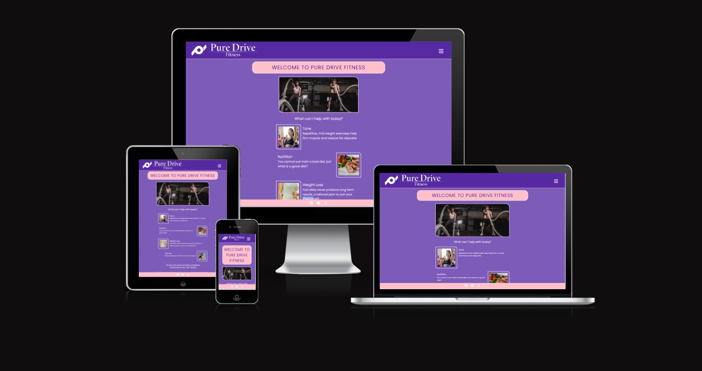

# Pure Drive Fitness

[Live webpage](https://spudos.github.io/Pure-Drive-Fitness/index.html)

## Table of Contents

- [1.0 Introduction](#10-introduction)
- [2.0 User Stories](#20-user-stories)
  - [2.1 As a First Time User](#21-as-a-first-time-user)
  - [2.2 As a Second Time User](#22-as-a-returning-user)
  - [2.3 As the Site Owner](#22-as-the-site-owner)
- [3.0 Website Concept and Wireframe](#30-website-concept-and-wireframe)
- [4.0 Features](#40-features)
  - [4.1 Colour Scheme and Font](#41-colour-scheme-and-font)
  - [4.2 Navigation](#42-navigation)
- [5.0 Pages](#50-pages)
  - [5.1 Index](#51-index)
  - [5.2 Booking and Pricing](#52-booking-and-pricing)
  - [5.3 Booking Form](#53-booking-form)
  - [5.4 About Me](#54-about-me)
  - [5.5 Contact](#55-contact)
- [6.0 Footer](#60-footer)
- [7.0 Testing](#70-testing)
- [8.0 unresolved Bugs](#80-unresolved-bugs)
- [9.0 Deployment](#90-deployment)
- [10.0 Credits](#100-credits)
  - [10.1 Media](#101-media)

## 1.0 Introduction

A client of mine has just finished training as a Personal Trainer

Pure Drive Fitness aims to provide friendly, informed and tailored training for people who have specific targets in mind or want to feel better about their physical fitness.  The site needs to provide confidence that the client is a well-educated, friendly and professional and able to help with different areas of training.

The target audience is primarily young to middle-aged clients.  

A simple, easy to use website would be the client’s preference.

## 2.0 User Stories

### 2.1 As a First Time User

1. Find out what services are available, how they are priced and when they are available

2. Contact the client to book sessions

3. Feel reassured that the client is knowledgable and qualified

4. Learn about the client and her background

5. Find out where the client operates

6. Contact the client

7. Read testimonials and success stories from other users

### 2.2 As a Returning User

8. Check what services are available that the user has not undertaken yet

9. Contact the client

10. Book sessions with the client

### 2.3 As the Site Owner

11. Fully responsive

12. Simple and easy to use navigation

13. A colour scheme that incorporates the shade of purple that is her key corporate style plus other colours that soften the imagery

14. A footer that shows her social media information

## 3.0 Website Concept and Wireframe

## 4.0 Features

### 4.1 Colour Scheme and Font

The selected colour scheme for the site was as follows with purple the dominant colour.  Pink icons and borders would be used with white used mainly for text and backgrounds. We will add some animation to navigation links in order to add a little visual interest to the site

Purple: rgb(70, 22, 154)
Pink: rgb(255, 192, 203)
White: rgb(255, 255, 255)

Transparancy will be used where appropriate to add any required variatiosn to the colour scheme

After a review of Google Fonts 'Poppins' was selected as the primary font with Amatic SC used for quote style text

### 4.2 Navigation

The navigation function must exist on all pages and be fully responsive

It will be identical on each page and will be shown as a 'hamburger' menu

This section will allow the user to easily navigate from page to page across all devices without having to revert back to the previous page via the ‘back’ button

## 5.0 Pages

### 5.1 Index

The landing page will include a hero image connected to training in some way

The body will include some simple information to direct you to other areas of the site that you may be interested in and some testimonial information

User Stories covered - 2, 6

### 5.2 Booking and Pricing

This page will show the various types of session and the price for each session

This will also give information on how to book sessions

There will be a featured sessions which would be some sort of cost effective package

User Stories covered - 1, 2, 7, 9

### 5.3 Booking Form

The booking form will provide a simple tool to capture the initial information for thre client to make a booking

This will be navigated to via the booking page so that the user is aware of the pricing structure and style of the sessions before they make a booking

User Stories covered - 1, 8, 9

### 5.4 About Me

This page is about introducing the client to the customer

People often feel nervous about signing up with a Personal Trainer, so it is important to show that the client is a friendly and likable person who really wants to help the customer with their personal journey

The text needs to highlight the training the client has undertaken

User Stories covered - 1, 2, 3

### 5.5 Contact

We will include a simple sign-up form that does not require too much information so that there are few barriers to the sign up

We want to gather just enough information for the client to be able to contact the customer and begin the process of arranging session

We will include location information in the form of google maps and an address

User Stories covered - 4, 5, 8

### 6.0 Footer

The footer will include links to social media (Instagram, Facebook, X) as the client will update customers on events via these mediums

## 7.0 Testing

The site has been tested manually on all formats from 320px wide (commonly used on iphones) up to full desktop sizes over 1800px using using browser web developer tools

The format was also checked on
Iphone 12
Iphone 14
ipad Mini
Ipad Pro 12.9"
Macbook Pro
Desktop PC

### HTML and CSS

The W3C validation service was used to validate the HTML and CSS code with no errors reported

index.html [results](https://validator.w3.org/nu/?doc=https%3A%2F%2Fspudos.github.io%2FPure-Drive-Fitness%2Findex.html)

book.html [results](https://validator.w3.org/nu/?doc=https%3A%2F%2Fspudos.github.io%2FPure-Drive-Fitness%2Fbook.html)

book-from.html [results](https://validator.w3.org/nu/?doc=https%3A%2F%2Fspudos.github.io%2FPure-Drive-Fitness%2Fbook-form.html)

about.html [results](https://validator.w3.org/nu/?doc=https%3A%2F%2Fspudos.github.io%2FPure-Drive-Fitness%2Fabout.html)

contact.html [results](https://validator.w3.org/nu/?doc=https%3A%2F%2Fspudos.github.io%2FPure-Drive-Fitness%2Fcontact.html)

style.css [results](https://jigsaw.w3.org/css-validator/validator?uri=https%3A%2F%2Fspudos.github.io%2FPure-Drive-Fitness%2Findex.html&profile=css3svg&usermedium=all&warning=1&vextwarning=&lang=en)

### Accessibility

The WAVE WebAIM web accessibility evaluation tool was used to ensure the website met high accessibility standards

index.html [results](https://wave.webaim.org/report#/https://spudos.github.io/Pure-Drive-Fitness/index.html)

book.html [results](https://wave.webaim.org/report#/https://spudos.github.io/Pure-Drive-Fitness/book.html)

book-from.html [results](https://wave.webaim.org/report#/https://spudos.github.io/Pure-Drive-Fitness/book-form.html)

about.html [results](https://wave.webaim.org/report#/https://spudos.github.io/Pure-Drive-Fitness/about.html)

contact.html [results](https://wave.webaim.org/report#/https://spudos.github.io/Pure-Drive-Fitness/contact.html)

### Performance

Chrome lighthouse tools were used to verify that all performance ratings were satisfactory

## 8.0 Unresolved Bugs

All bugs were resolved as they were discovered

## 9.0 Deployment

The site is deployed via github pages and can be found from this link

[Pure-Drive-Fitness](https://spudos.github.io/Pure-Drive-Fitness/)

## 10.0 Credits

### 10.1 Media

Google fonts was used for additional fonts as required

[Google fonts](https://fonts.google.com/)

Font Awesome was used for icons

[Font Awesome](https://fontawesome.com/)

Pexels.com was used for the images on the website

[pexels.com](https://www.pexels.com/)

The site logo and favicon was produced by Sam Pierce

[Sam Pierce](https://www.sampiercephotography.com)
