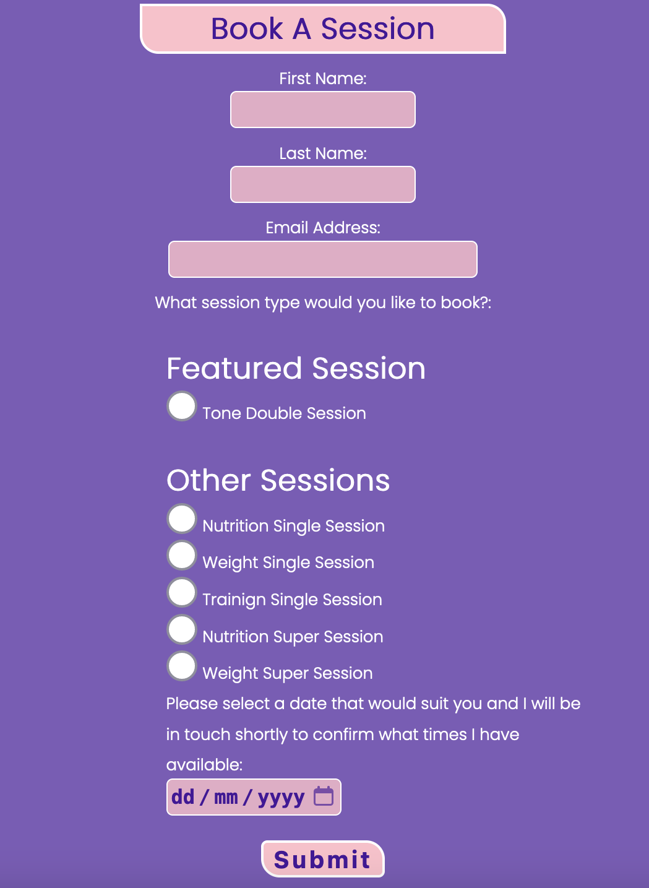

# Pure Drive Fitness

[Live webpage](https://spudos.github.io/Pure-Drive-Fitness/index.html)

## Table of Contents

- [1.0 Introduction](#10-introduction)
- [2.0 User Stories](#20-user-stories)
  - [2.1 As a First Time User](#21-as-a-first-time-user)
  - [2.2 As a Second Time User](#22-as-a-returning-user)
  - [2.3 As the Site Owner](#23-as-the-site-owner)
- [3.0 Website Concept, Structure and Wireframe](#30-website-concept-and-wireframe)
  - [3.1 Index](#31-index)
  - [3.2 Booking and Pricing](#32-booking-and-pricing)
  - [3.3 Booking Form](#33-booking-form)
  - [3.4 About Me](#34-about-me)
  - [3.5 Contact](#35-contact)
- [4.0 Features](#40-features)
  - [4.1 Colour Scheme and Font](#41-colour-scheme-and-font)
  - [4.2 Navigation](#42-navigation)
  - [4.3 Hero Image](#43-hero-image)
  - [4.4 Homepage Mid Section](#44-homepage-mid-section)
  - [4.5 Testimonials](#45-testimonials)
  - [4.6 Accreditations](#46-accreditations)
  - [4.7 Information on Types of Session](#47-information-on-types-of-session)
  - [4.8 Pricing](#48-pricing)
  - [4.9 Booking Form](#49-booking-form)
  - [4.10 About Me Section](#410-about-me-section)
  - [4.11 Contact Me Section](#411-contact-me-section)
  - [4.12 Map](#412-map)
  - [4.13 Logo](#413-logo)
  - [4.14 Footer](#414-footer)
- [5.0 Testing](#50-testing)
  - [5.1 Tests on Various Devices](#51-tests-on-various-devices)
  - [5.2 HTML and CSS](#52-html-and-css)
  - [5.3 Accessibility](#53-accessibility)
  - [5.4 Performance](#54-performance)
  - [5.5 Browser Compatibility](#55-browser-compatibility)
  - [5.6 Test User Stories](#56-test-user-stories)
- [6.0 Unresolved Bugs](#60-unresolved-bugs)
- [7.0 Deployment](#70-deployment)
- [8.0 Credits](#80-credits)
  - [8.1 Media](#81-media)

## 1.0 Introduction

A client of mine has just finished training as a Personal Trainer

Pure Drive Fitness aims to provide friendly, informed and tailored training for people who have specific targets in mind or want to feel better about their physical fitness.  The site needs to provide confidence that the client is a well-educated, friendly and professional and able to help with different areas of training.

The target audience is primarily young to middle-aged clients.  

A simple, easy to use website would be the client’s preference.

## 2.0 User Stories

### 2.1 As a First Time User

1. Find out what services are available and how they are priced

2. Contact the client to book sessions

3. Feel reassured that the client is knowledgable and qualified

4. Learn about the client and her background

5. Find out where the client operates

6. Contact the client

7. Read testimonials and success stories from other users

### 2.2 As a Returning User

8. Check what services are available that the user has not undertaken yet

9. Contact the client

10. Book sessions with the client

### 2.3 As the Site Owner

11. Fully responsive

12. Simple and easy to use navigation

13. A colour scheme that incorporates the shade of purple that is her key corporate style plus other colours that soften the imagery.  The provided corporate logo will be used

14. A footer that has links to her social media accounts

15. Have a hero image that is inspriational to users

## 3.0 Website Concept and Wireframe

### 3.1 Index

The landing page will include a hero image connected to physical training

The body will include some headline information about the type of services the client provides and futher images that are meant to be inspirational

Testimonials and a visual representation of the clients accreditations will be included

User Stories covered - 3, 4, 7, 11, 12, 13, 14, 15

### 3.2 Booking and Pricing

This page will show the various types of session and the price for each session

This will also give a link to book sessions

There will be a featured sessions which would be some sort of cost effective package

User Stories covered - 1, 2, 6, 7, 8, 9, 10, 11, 12, 13, 14

### 3.3 Booking Form

The booking form will provide a simple tool to capture the initial information for the user to make a booking

This will be navigated to via the booking page so that the user is aware of the pricing structure and style of the sessions before they make a booking

User Stories covered - 2, 6, 9, 10, 11, 12, 13, 14

### 3.4 About Me

This page is about introducing the client to the customer

People often feel nervous about signing up with a Personal Trainer, so it is important to show that the client is a friendly and likable person who really wants to help the customer with their personal journey

It should include positive imagery that has an uplifting feel

User Stories covered - 1, 3, 4, 7, 11, 12, 13, 14

### 3.5 Contact

We will include a simple sign-up form that does not require too much information so that there are few barriers to the sign up

We want to gather just enough information for the client to be able to contact the user when the user is not yet ready to book a session

We will also show email and telephone contact information

We will include location information in the form of google maps and an address

User Stories covered - 2, 5, 6, 9, 11, 12, 13, 14

## 4.0 Features

### 4.1 Colour Scheme and Font

The selected colour scheme for the site was as follows with purple the dominant colour.  Pink icons and borders would be used with white used mainly for text and backgrounds. We will add some animation to navigation links in order to add a little visual interest to the site

Purple: rgb(70, 22, 154)
Pink: rgb(255, 192, 203)
White: rgb(255, 255, 255)

Transparancy will be used where appropriate to add any required variatiosn to the colour scheme

After a review of Google Fonts 'Poppins' was selected as the primary font with Amatic SC used for quote style text

### 4.2 Navigation

The navigation function must exist on all pages and be fully responsive

This section will allow the user to easily navigate from page to page across all devices without having to revert back to the previous page via the ‘back’ button

It will be identical on each page and will be shown as a 'hamburger' menu

When expanded it shows simple navigation option, is underlined to show the active page and is animated on hover so the user knows which page will be selected

Other links are shown that are usually white but change to pink on hover.  These are used to provide quick navigation at convienient places on the site

Buttons will also be used that change color on hover, again these are used to give quick navigation options and to direct the flow of the site

### 4.3 Hero Image

This has a very simple header above the hero image as we already use the company logo in the header and we want the strong images of fit people training and exercises to be highly insprirational

### 4.4 Homepage Mid Section

This shows headline information about key areas of the clients expertise and pictures that motivate you to strive to be like the people in the image or to find out more

### 4.5 Testimonials

Shown using the Amatic SC font so it is eyecatching, looks more like "speech" and adds visual variety to the page the testimonial can be see in this image about the accreditation section

The testimonials give reassurance from users that the client is knowledgable and capable

### 4.6 Accreditations

A visual representation of the clients credentials this section is outlined in pink to highlight it and give reassurance that the client has undergone extensive training

### 4.7 Information on Types of Session

A responive grid system is used to show most of the available sessions in one view (on desktop)

Buttons provide the oppourtunity for the user to book a session via the booking form

### 4.8 Pricing

Pricing is shown on each session view as per the screenshot above

Below the session descriptions is a text description of the types of session

### 4.9 Booking Form

The booking form captures the information required to begin the process of booking sessions

A date selector is included so the user can pick the preferred day for the session

### 4.10 About Me Section

It is importnnt to show the client as a friendly and qualifed personal trainer and this is what the about me page does

It is difficult to give the level of information required without it becoming quite "wordy" so the page is split up with interesting images

### 4.11 Contact Me Section

The contact me form uses a similar layout to the booking page but also asks the user what their main goals are and has email and phone contact details

### 4.12 Map

The google maps iframe is shown on the contact me page so that the user knows where sessions are to be held

### 4.13 Logo

The company logo is white on a transparent background and is included at the top of each page

The white contrasts well with the purple header

### 4.14 Footer

The footer displays links to the clients three social media accounts

Each logo will change color and animate on hove so the user knows they are highlighting it

## 5.0 Testing

The site has been tested manually on all formats from 320px wide (commonly used on iphones) up to full desktop sizes over 1800px using using browser web developer tools

### 5.1 Tests on Various Devices

The website was checked on
- Iphone 12
- Iphone 14
- Ipad Mini
- Ipad Pro 12.9"
- Macbook Pro
- Desktop PC

### 5.2 HTML and CSS

The W3C validation service was used to validate the HTML and CSS code with no errors reported

index.html [results](https://validator.w3.org/nu/?doc=https%3A%2F%2Fspudos.github.io%2FPure-Drive-Fitness%2Findex.html)

book.html [results](https://validator.w3.org/nu/?doc=https%3A%2F%2Fspudos.github.io%2FPure-Drive-Fitness%2Fbook.html)

book-from.html [results](https://validator.w3.org/nu/?doc=https%3A%2F%2Fspudos.github.io%2FPure-Drive-Fitness%2Fbook-form.html)

about.html [results](https://validator.w3.org/nu/?doc=https%3A%2F%2Fspudos.github.io%2FPure-Drive-Fitness%2Fabout.html)

contact.html [results](https://validator.w3.org/nu/?doc=https%3A%2F%2Fspudos.github.io%2FPure-Drive-Fitness%2Fcontact.html)

style.css [results](https://jigsaw.w3.org/css-validator/validator?uri=https%3A%2F%2Fspudos.github.io%2FPure-Drive-Fitness%2Findex.html&profile=css3svg&usermedium=all&warning=1&vextwarning=&lang=en)

### 5.3 Accessibility

The WAVE WebAIM web accessibility evaluation tool was used to ensure the website met high accessibility standards

index.html [results](https://wave.webaim.org/report#/https://spudos.github.io/Pure-Drive-Fitness/index.html)

book.html [results](https://wave.webaim.org/report#/https://spudos.github.io/Pure-Drive-Fitness/book.html)

book-form.html [results](https://wave.webaim.org/report#/https://spudos.github.io/Pure-Drive-Fitness/book-form.html)

about.html [results](https://wave.webaim.org/report#/https://spudos.github.io/Pure-Drive-Fitness/about.html)

contact.html [results](https://wave.webaim.org/report#/https://spudos.github.io/Pure-Drive-Fitness/contact.html)

### 5.4 Performance

Chrome lighthouse tools were used to verify that all performance ratings were satisfactory

index.html

book.html

book-form.html

about.html

contact.html

### 5.5 Browser compatibility

The website was tested on the these browsers:

- Google Chrome
- Apple Safari
- Mozilla Firefox

### 5.6 Test User Stories

### As a First Time User

1. Find out what services are available and how they are priced

| **Feature** | **Action** | **Result** |
|-------------|------------|---------------------|
| Session grid | On booking page see boxes with information in them | all necessary info is displayed |

2. Contact the client to book sessions

| **Feature** | **Action** | **Result** |
|-------------|------------|---------------------|
| Booking form | On booking page click "book" button to go to booking form and complete that form | User can send booking form and select a date for a session |
| Pricing | On booking page see boxes with pricing information in them | All necessary info is displayed |

3. Feel reassured that the client is knowledgable and qualified

| **Feature** | **Action** | **Result** |
|-------------|------------|---------------------|
| About me | On about me page see comprehensive info about the client | Reassurance and infromation is given via the text |
| Accreditations | Scroll to the bottom of the index page | A visual representation of the clients qualifications is shown |
| Homepage mid section | Scroll to the middle of the index page | A visual representation with text of the clients expertise is shown |

4. Learn about the client and her background

| **Feature** | **Action** | **Result** |
|-------------|------------|---------------------|
| About me | On about me page see comprehensive info about the client | Reassurance and infromation is given via the text |
| Accreditations | Scroll to the bottom of the index page | A visual representation of the clients qualifications is shown |

5. Find out where the client operates

| **Feature** | **Action** | **Result** |
|-------------|------------|---------------------|
| Map | On contact page see iframe including the map | The map clearly shows where sessions are held |

6. Contact the client

| **Feature** | **Action** | **Result** |
|-------------|------------|---------------------|
| Contact page | Send contact form to client or use email and phone details | Using this page multiple contact options are shown and usuable |

7. Read testimonials and success stories from other users

| **Feature** | **Action** | **Result** |
|-------------|------------|---------------------|
| Testimonials | On various pages testimonials are shown | Quotes from users are included on the site |

### As a Returning User

8. Check what services are available that the user has not undertaken yet

| **Feature** | **Action** | **Result** |
|-------------|------------|---------------------|
| Session grid | On booking page see boxes with information in them | All necessary info is displayed |
| Pricing | On booking page see boxes with pricing information in them | All necessary info is displayed |

9. Contact the client

| **Feature** | **Action** | **Result** |
|-------------|------------|---------------------|
| Contact page | Send contact form to client or use email and phone details | Using this page multiple contact options are shown and usuable |

10. Book sessions with the client

| **Feature** | **Action** | **Result** |
|-------------|------------|---------------------|
| Booking form | On booking page click "book" button to go to booking form and complete that form | User can send booking form and select a date for a session |

### As the Site Owner

11. Fully responsive

| **Feature** | **Action** | **Result** |
|-------------|------------|---------------------|
| All pages | Test on multiple screen sizes | All content is viewable on all screen sizes |

12. Simple and easy to use navigation

| **Feature** | **Action** | **Result** |
|-------------|------------|---------------------|
| Navigation | View and open/close hamburger menu | Simple page links, indicators and animation satisfy the requirement |

13. A colour scheme that incorporates the shade of purple that is her key corporate style plus other colours that soften the imagery.  The provided corporate logo will be used

| **Feature** | **Action** | **Result** |
|-------------|------------|---------------------|
| Color scheme and font | View color scheme on all pages | The site color scheme is in line with the client requirements |
| Logo | View logo at the top of all pages | The client logo is shown and contrasts well with the header background |

14. A footer that has links to her social media accounts

| **Feature** | **Action** | **Result** |
|-------------|------------|---------------------|
| Footer | Scroll to the bottom of any page | Social media links are shown in the footer |

15. Have a hero image that is inspriational to users

| **Feature** | **Action** | **Result** |
|-------------|------------|---------------------|
| Hero | View the top of the homepage | A hero image of two people working hard in the gym is included |

## 6.0 Unresolved Bugs

All bugs were resolved as they were discovered

## 7.0 Deployment

The site is deployed via github pages and can be found from this link

[Pure-Drive-Fitness](https://spudos.github.io/Pure-Drive-Fitness/)

## 8.0 Credits

### 8.1 Media

Google fonts was used for additional fonts as required

[Google fonts](https://fonts.google.com/)

Font Awesome was used for icons

[Font Awesome](https://fontawesome.com/)

Pexels.com was used for the images on the website

[pexels.com](https://www.pexels.com/)

The site logo and favicon was produced by Sam Pierce

[Sam Pierce](https://www.sampiercephotography.co.uk)
